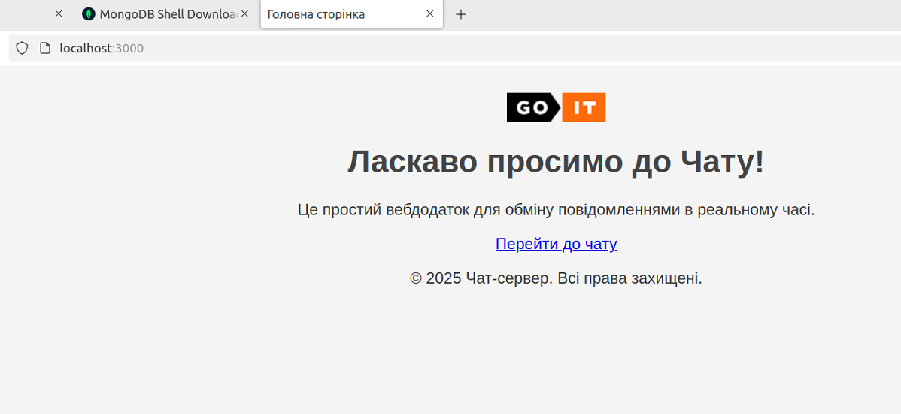
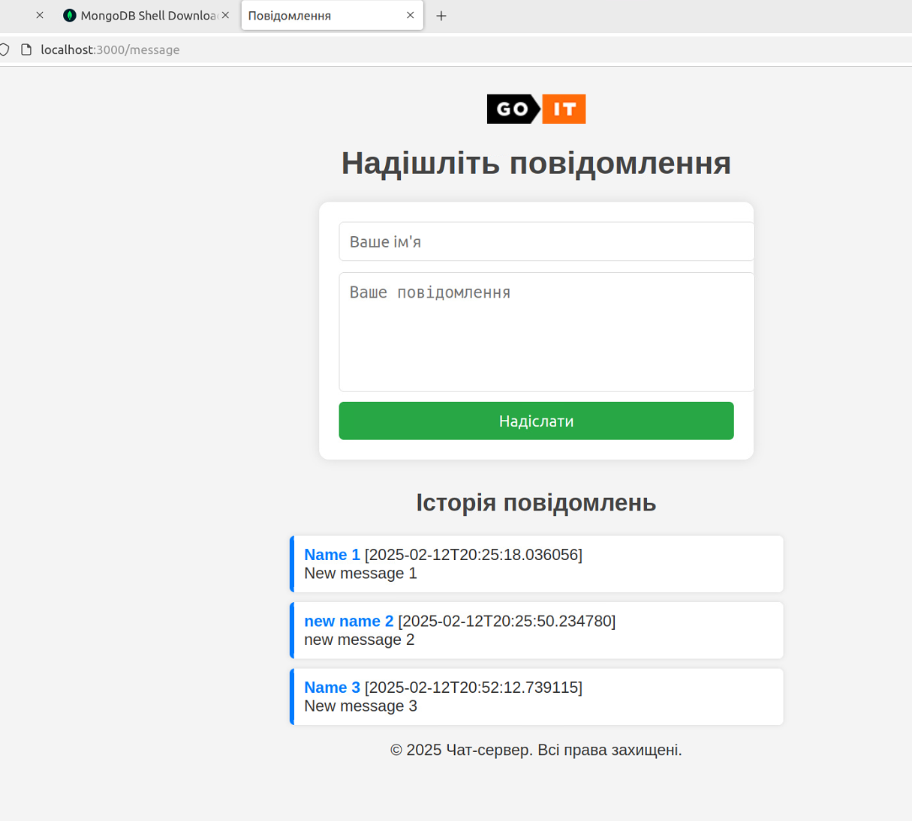

# goit-cs-hw-06

### Технічний опис завдання

Вам необхідно реалізувати найпростіший вебдодаток, не використовуючи вебфреймворк.

#### Інструкція та вимоги до виконання

За аналогією до розглянутого в конспекті прикладу, створіть вебдодаток з маршрутизацією для двох html-сторінок: index.html та message.html.

#### Також:

обробіть під час роботи програми статичні ресурси: style.css, logo.png;

організуйте роботу з формою на сторінці message.html;

у разі виникнення помилки 404 Not Found повертайте сторінку error.html

ваш HTTP-сервер повинен працювати на порту 3000.

#### Для роботи з формою створіть Socket-сервер на порту 5000. Алгоритм роботи має бути такий:

вводите дані у форму,

вони потрапляють у вебдодаток, який пересилає його далі на обробку за допомогою socket (протокол UDP або TCP на ваш вибір) Socket-серверу,

Socket-сервер переводить отриманий байт-рядок у словник і зберігає його в базу даних MongoDb.


**Формат запису документа MongoDB має бути наступного вигляду:**
```
{  
	"date": "2022-10-29 20:20:58.020261",    
	"username": "krabaton",    
	"message": "First message"  
},  
{ 
	"date": "2022-10-29 20:21:11.812177",
  "username": "Krabat",    
	"message": "Second message"  
}
```

Ключ "date" кожного повідомлення — це час отримання повідомлення: datetime.now(). Тобто кожне нове повідомлення від вебпрограми має дописуватися до бази даних з часом отримання.

#### Критерії прийняття

Використано для створення вебпрограми один файл main.py. Запущено HTTP-сервер і Socket-сервер у різних процесах.

Створено Dockerfile та запущено додаток як Docker-контейнер.

Написано docker-compose.yaml з конфігурацією для застосунку та MongoDB.

Використано Docker Compose для побудови середовища, команду docker-compose up для запуску середовища.

За допомогою механізму voluemes збережено дані з бази даних не всередині контейнера.

Оброблено статичні ресурси: style.css, logo.png.

У разі виникнення помилки 404 Not Found повертається сторінка error.html.

Робота з формою організована згідно з наведеними вище вимогами.

Формат запису документа MongoDB відповідає вищезазначеним вимогам.

**Для запуску docker у терміналі:**
```
sudo docker compose up --build
WARN[0000] /home/oza/work/goit/goit-cs-hw-06/docker-compose.yaml: the attribute `version` is obsolete, it will be ignored, please remove it to avoid potential confusion 
[+] Building 5.5s (10/10) FINISHED                                                       docker:default
 => [web internal] load build definition from Dockerfile                                           0.0s
 => => transferring dockerfile: 131B                                                               0.0s
 => [web internal] load metadata for docker.io/library/python:3.9                                  0.0s
 => [web internal] load .dockerignore                                                              0.0s
 => => transferring context: 2B                                                                    0.0s
 => [web 1/4] FROM docker.io/library/python:3.9                                                    0.0s
 => [web internal] load build context                                                              0.0s
 => => transferring context: 9.34kB                                                                0.0s
 => CACHED [web 2/4] WORKDIR /app                                                                  0.0s
 => [web 3/4] COPY . /app                                                                          0.0s
 => [web 4/4] RUN pip install pymongo                                                              5.2s
 => [web] exporting to image                                                                       0.1s 
 => => exporting layers                                                                            0.1s 
 => => writing image sha256:92f1cdf53c054a97b00282d957e00ced608372601b384a5aee3f07a7acee346d       0.0s 
 => => naming to docker.io/library/goit-cs-hw-06-web                                               0.0s 
 => [web] resolving provenance for metadata file                                                   0.0s 
[+] Running 3/3                                                                                         
 ✔ web                              Built                                                          0.0s 
 ✔ Container goit-cs-hw-06-mongo-1  Created                                                        0.0s 
 ✔ Container goit-cs-hw-06-web-1    Recreated                                                      0.0s 
Attaching to mongo-1, web-1
mongo-1  | {"t":{"$date":"2025-02-12T21:11:32.321+00:00"},"s":"I",  "c":"CONTROL",  "id":23285,   "ctx":"main","msg":"Automatically disabling TLS 1.0, to force-enable TLS 1.0 specify --sslDisabledProtocols 'none'"}
mongo-1  | {"t":{"$date":"2025-02-12T21:11:32.322+00:00"},"s":"I",  "c":"CONTROL",  "id":5945603, "ctx":"main","msg":"Multi threading initialized"}
mongo-1  | {"t":{"$date":"2025-02-12T21:11:32.322+00:00"},"s":"I",  "c":"NETWORK",  "id":4648601, "ctx":"main","msg":"Implicit TCP FastOpen unavailable. If TCP FastOpen is required, set at least one of the related parameters","attr":{"relatedParameters":["tcpFastOpenServer","tcpFastOpenClient","tcpFastOpenQueueSize"]}}
mongo-1  | {"t":{"$date":"2025-02-12T21:11:32.322+00:00"},"s":"I",  "c":"NETWORK",  "id":4915701, "ctx":"main","msg":"Initialized wire specification","attr":{"spec":{"incomingExternalClient":{"minWireVersion":0,"maxWireVersion":25},"incomingInternalClient":{"minWireVersion":0,"maxWireVersion":25},"outgoing":{"minWireVersion":6,"maxWireVersion":25},"isInternalClient":true}}}
mongo-1  | {"t":{"$date":"2025-02-12T21:11:32.323+00:00"},"s":"I",  "c":"TENANT_M", "id":7091600, "ctx":"main","msg":"Starting TenantMigrationAccessBlockerRegistry"}
mongo-1  | {"t":{"$date":"2025-02-12T21:11:32.323+00:00"},"s":"I",  "c":"CONTROL",  "id":4615611, "ctx":"initandlisten","msg":"MongoDB starting","attr":{"pid":1,"port":27017,"dbPath":"/data/db","architecture":"64-bit","host":"aac39b35619e"}}
```


**Для запуску в браузері:**
```
http://localhost:3000/
```



**Далі, натиснути "Перейти до чату" або в браузері:**
```
http://localhost:3000/message
```
